# Dubai Retail OS — Developer Architecture Guide

> **Stack:** Go 1.22 · PostgreSQL 16 · Redis 7 · Asynq · Docker Compose  
> **Last Updated:** March 2026  

---

## Table of Contents

1. [System Overview](#system-overview)
2. [Directory Structure](#directory-structure)
3. [Complete Request Flow](#complete-request-flow)
4. [Product & Pricing Flow](#product--pricing-flow)
5. [Order Processing Flow](#order-processing-flow)
6. [FIFO Stock Deduction](#fifo-stock-deduction)
7. [UAE PINT-AE Compliance Flow](#uae-pint-ae-compliance-flow)
8. [ASP Sandbox Validation Flow](#asp-sandbox-validation-flow)
9. [Batch Import (China Shipments)](#batch-import-china-shipments)
10. [RMA / Returns Flow](#rma--returns-flow)
11. [Background Worker Jobs](#background-worker-jobs)
12. [Alerting Rules & Prometheus Integration](#alerting-rules--prometheus-integration)
13. [Analytics Module](#analytics-module)
14. [VAT Calculation Rules](#vat-calculation-rules)
15. [COGS & Landed Cost Engine](#cogs--landed-cost-engine)
16. [Multi-Channel Price Resolution](#multi-channel-price-resolution)
17. [Monitoring & Alerts](#monitoring--alerts)
18. [Transaction Isolation Strategy](#transaction-isolation-strategy)
19. [Environment Variables](#environment-variables)

---

## System Overview

```
┌─────────────────────────────────────────────────────────────────┐
│                       Dubai Retail OS                           │
│                                                                 │
│  ┌──────────┐   ┌─────────────┐   ┌────────────────────────┐  │
│  │  POS     │   │  E-Commerce  │   │  Wholesale Portal      │  │
│  │ (Sunmi)  │   │  (Next.js)  │   │  (Admin/B2B)           │  │
│  └────┬─────┘   └──────┬──────┘   └──────────┬─────────────┘  │
│       └────────────────┼──────────────────────┘                 │
│                        │  REST / JSON                           │
│              ┌─────────▼──────────┐                            │
│              │    Go HTTP API     │ :8080                       │
│              │    chi router      │                             │
│              └─────────┬──────────┘                            │
│                        │                                        │
│         ┌──────────────┼──────────────────┐                   │
│         │              │                  │                    │
│  ┌──────▼──────┐ ┌─────▼──────┐  ┌───────▼──────┐           │
│  │  Product    │ │   Order    │  │  Inventory   │           │
│  │  Service    │ │  Service   │  │  Service     │           │
│  └──────┬──────┘ └─────┬──────┘  └───────┬──────┘           │
│         │              │                  │                    │
│  ┌──────▼──────┐ ┌─────▼──────┐  ┌───────▼──────┐           │
│  │ PriceResolver│ │Compliance │  │ FIFO Engine  │           │
│  │ (waterfall) │ │ Service   │  │ (Serializable│           │
│  └─────────────┘ └─────┬──────┘  │  TX)         │           │
│                        │         └──────────────┘            │
│              ┌─────────▼──────────┐                          │
│              │   PostgreSQL 16    │                           │
│              │   + Redis 7        │                           │
│              └────────────────────┘                          │
│                                                               │
│  ┌────────────────────────────────────────────────────────┐  │
│  │  Asynq Workers (background)                            │  │
│  │  • Abandoned Cart Cleanup (every 1 min)               │  │
│  │  • Prometheus Gauge Refresh (every 30 s)              │  │
│  │  • Low-Stock Check (every 5 min)                      │  │
│  └────────────────────────────────────────────────────────┘  │
└─────────────────────────────────────────────────────────────────┘
```

---

## Directory Structure

```
/
├── cmd/
│   └── server/
│       └── main.go              # Entry point: wires deps, starts HTTP + worker
├── internal/
│   ├── config/
│   │   └── config.go            # Load env vars into Config struct
│   ├── domain/                  # Pure Go structs, zero DB dependencies
│   │   ├── batch.go             # PurchaseBatch, BatchItem, LandedCostEngine
│   │   ├── channel.go           # Channel, ChannelPrice, ChannelType enum
│   │   ├── inventory.go         # Inventory, InventoryMovement, MovementType
│   │   ├── order.go             # Order, OrderItem, EInvoice, UBL types
│   │   ├── payment.go           # PaymentGateway, GatewayConfig
│   │   ├── pricing.go           # PricePromotion, PriceResult, OrderInvoice
│   │   ├── product.go           # Product, Variant, VATType
│   │   └── rma.go               # Return, ReturnItem, ReturnPhoto, QCResult
│   ├── handler/
│   │   └── http/
│   │       └── router/
│   │           ├── router.go           # chi route wiring
│   │           ├── inventory_handler.go
│   │           ├── invoice_handler.go
│   │           ├── order_handler.go
│   │           ├── product_handler.go
│   │           └── rma_handler.go
│   ├── invoice/                 # UAE PINT-AE UBL 2.1 serializer
│   │   ├── serializer.go        # Serialize(EInvoice) → []byte XML
│   │   ├── serializer_test.go
│   │   └── ubl_types.go         # Go structs mirroring UBL 2.1 schema
│   ├── metrics/
│   │   ├── metrics.go           # All Prometheus metric definitions
│   │   └── middleware.go        # HTTP middleware + gauge helpers
│   ├── repository/
│   │   ├── postgres/
│   │   │   ├── inventory.go
│   │   │   ├── invoice_store.go
│   │   │   ├── order.go
│   │   │   ├── pool.go
│   │   │   ├── pricing.go
│   │   │   ├── product.go
│   │   │   ├── repositories.go  # Bundles all repos
│   │   │   ├── reservation.go   # Expired-reservation queries
│   │   │   ├── rma.go
│   │   │   └── types.go         # FIFOBatchItemRow
│   │   └── redis/
│   │       └── client.go
│   └── service/
│       ├── compliance.go        # Evaluate + Execute e-invoice compliance
│       ├── compliance_test.go
│       ├── gateway_selector.go  # Configurable payment gateway routing
│       ├── helpers.go
│       ├── integration_test.go  # Full-pipeline tests (build tag: integration)
│       ├── inventory.go         # FIFO SubtractStock, ReserveStock
│       ├── inventory_test.go
│       ├── order.go             # ProcessOrder orchestrator
│       ├── price_resolver.go    # Waterfall price resolution
│       ├── price_resolver_test.go
│       ├── product.go           # CreateProductWithVariants, SetPrice
│       ├── rma.go               # CreateReturn, UploadPhoto, ApproveReturn
│       └── services.go          # Dependency injection wiring
├── migrations/
│   ├── 001_initial_schema.sql
│   ├── 002_price_promotions_and_invoices.sql
│   └── 003_returns_rma.sql
├── deployments/
│   ├── grafana/
│   │   └── provisioning/
│   │       ├── dashboards/
│   │       │   ├── dashboards.yml
│   │       │   └── dubai_retail_ops.json  # Pre-built Grafana dashboard
│   │       └── datasources/
│   │           └── prometheus.yml
│   └── prometheus/
│       └── prometheus.yml
├── docs/
│   └── ARCHITECTURE.md          # This file
├── docker-compose.yml
├── Dockerfile
├── go.mod
└── .env.example
```

---

## Complete Request Flow

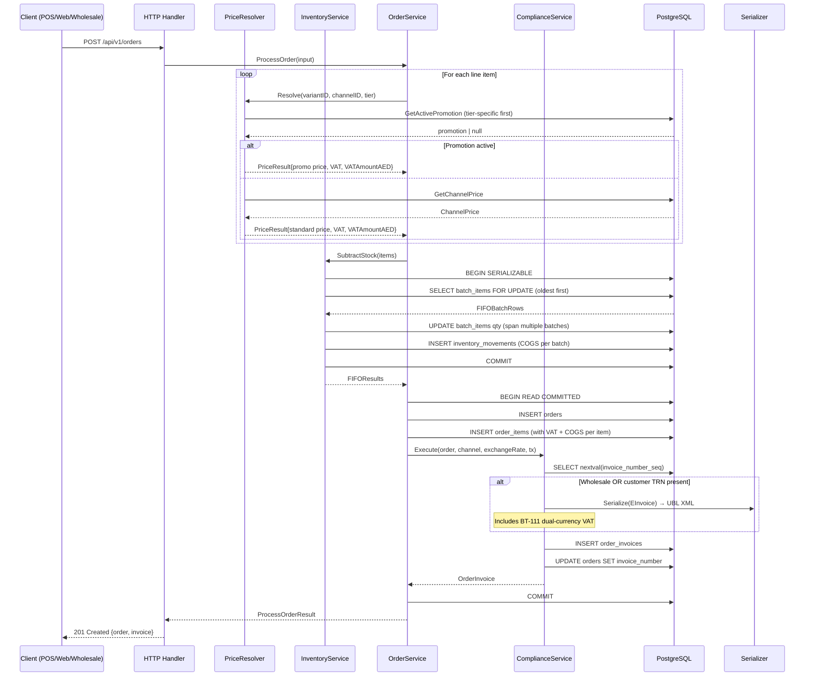
```mermaid
sequenceDiagram
    participant Client as Client (POS/Web/Wholesale)
    participant Handler as HTTP Handler
    participant PriceResolver
    participant InventoryService
    participant OrderService
    participant ComplianceService
    participant DB as PostgreSQL

    Client->>Handler: POST /api/v1/orders
    Handler->>OrderService: ProcessOrder(input)

    %% Price Resolution
    loop For each line item
        OrderService->>PriceResolver: Resolve(variantID, channelID, tier)
        PriceResolver->>DB: GetActivePromotion (tier-specific first)
        DB-->>PriceResolver: promotion | null
        alt Promotion active
            PriceResolver-->>OrderService: PriceResult{promo price, VAT, VATAmountAED}
        else
            PriceResolver->>DB: GetChannelPrice
            DB-->>PriceResolver: ChannelPrice
            PriceResolver-->>OrderService: PriceResult{standard price, VAT, VATAmountAED}
        end
    end

    %% FIFO Stock Deduction (Serializable TX)
    OrderService->>InventoryService: SubtractStock(items)
    InventoryService->>DB: BEGIN SERIALIZABLE
    InventoryService->>DB: SELECT batch_items FOR UPDATE (oldest first)
    DB-->>InventoryService: FIFOBatchRows
    InventoryService->>DB: UPDATE batch_items qty (span multiple batches)
    InventoryService->>DB: INSERT inventory_movements (COGS per batch)
    InventoryService->>DB: COMMIT
    InventoryService-->>OrderService: FIFOResults

    %% Order Write + Invoice (ReadCommitted TX)
    OrderService->>DB: BEGIN READ COMMITTED
    OrderService->>DB: INSERT orders
    OrderService->>DB: INSERT order_items (with VAT + COGS per item)

    %% Compliance
    OrderService->>ComplianceService: Execute(order, channel, exchangeRate, tx)
    ComplianceService->>DB: SELECT nextval(invoice_number_seq)
    alt Wholesale OR customer TRN present
        ComplianceService->>Serializer: Serialize(EInvoice) → UBL XML
        Note over ComplianceService: Includes BT-111 dual-currency VAT
    end
    ComplianceService->>DB: INSERT order_invoices
    ComplianceService->>DB: UPDATE orders SET invoice_number
    ComplianceService-->>OrderService: OrderInvoice

    OrderService->>DB: COMMIT
    OrderService-->>Handler: ProcessOrderResult
    Handler-->>Client: 201 Created {order, invoice}
```

---

## Product & Pricing Flow

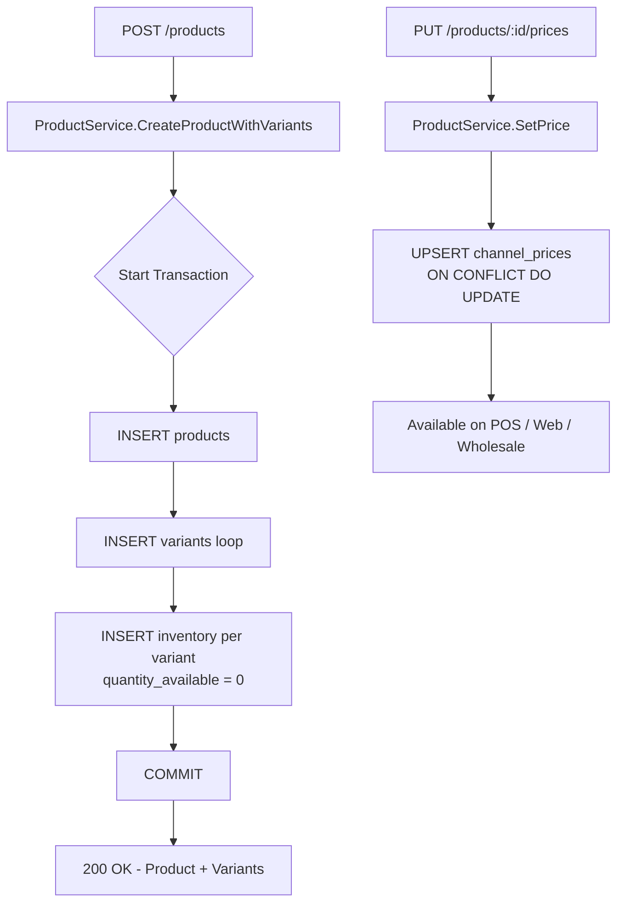
```mermaid
flowchart TD
    A[POST /products] --> B[ProductService.CreateProductWithVariants]
    B --> C{Start Transaction}
    C --> D[INSERT products]
    D --> E[INSERT variants loop]
    E --> F[INSERT inventory per variant\nquantity_available = 0]
    F --> G[COMMIT]
    G --> H[200 OK - Product + Variants]

    I[PUT /products/:id/prices] --> J[ProductService.SetPrice]
    J --> K[UPSERT channel_prices\nON CONFLICT DO UPDATE]
    K --> L[Available on POS / Web / Wholesale]
```

---

## Order Processing Flow

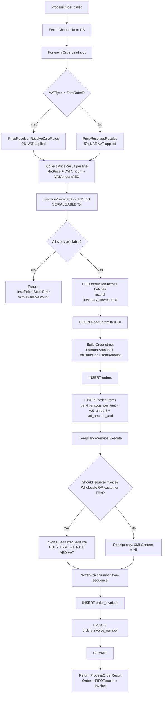
```mermaid
flowchart TD
    A[ProcessOrder called] --> B[Fetch Channel from DB]
    B --> C[For each OrderLineInput]
    C --> D{VATType = ZeroRated?}
    D -- Yes --> E[PriceResolver.ResolveZeroRated\n0% VAT applied]
    D -- No --> F[PriceResolver.Resolve\n5% UAE VAT applied]
    E & F --> G[Collect PriceResult per line\nNetPrice + VATAmount + VATAmountAED]

    G --> H[InventoryService.SubtractStock\nSERIALIZABLE TX]
    H --> I{All stock available?}
    I -- No --> J[Return InsufficientStockError\nwith Available count]
    I -- Yes --> K[FIFO deduction across batches\nrecord inventory_movements]

    K --> L[BEGIN ReadCommitted TX]
    L --> M[Build Order struct\nSubtotalAmount + VATAmount + TotalAmount]
    M --> N[INSERT orders]
    N --> O[INSERT order_items\nper-line: cogs_per_unit + vat_amount + vat_amount_aed]
    O --> P[ComplianceService.Execute]
    P --> Q{Should issue e-invoice?\nWholesale OR customer TRN?}
    Q -- Yes --> R[invoice.Serializer.Serialize\nUBL 2.1 XML + BT-111 AED VAT]
    Q -- No --> S[Receipt only, XMLContent = nil]
    R & S --> T[NextInvoiceNumber from sequence]
    T --> U[INSERT order_invoices]
    U --> V[UPDATE orders.invoice_number]
    V --> W[COMMIT]
    W --> X[Return ProcessOrderResult\nOrder + FIFOResults + Invoice]
```

---

## FIFO Stock Deduction

The FIFO engine finds the **oldest received batch** first (ordered by
`batch_items.received_at ASC`) and deducts units from it before moving to
the next batch. Each deduction is recorded in `inventory_movements` with
the exact `cogs_per_unit` (landed cost) from that specific batch, enabling
precise profit-margin reporting per order line.

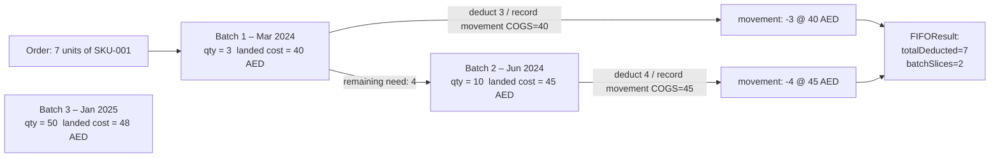
```mermaid
flowchart LR
    S[Order: 7 units of SKU-001]

    B1["Batch 1 – Mar 2024\nqty = 3  landed cost = 40 AED"]
    B2["Batch 2 – Jun 2024\nqty = 10  landed cost = 45 AED"]
    B3["Batch 3 – Jan 2025\nqty = 50  landed cost = 48 AED"]

    S --> B1
    B1 -->|deduct 3 / record movement COGS=40| M1[movement: -3 @ 40 AED]
    B1 -->|remaining need: 4| B2
    B2 -->|deduct 4 / record movement COGS=45| M2[movement: -4 @ 45 AED]

    M1 & M2 --> R[FIFOResult:\ntotalDeducted=7\nbatchSlices=2]
```

**Race-condition prevention:**  
`SELECT ... FOR UPDATE` is issued on all `batch_items` for a given variant
inside a `SERIALIZABLE` transaction. Concurrent orders on the same SKU will
queue behind the lock, preventing double-deduction.

---

## ASP Sandbox Validation Flow

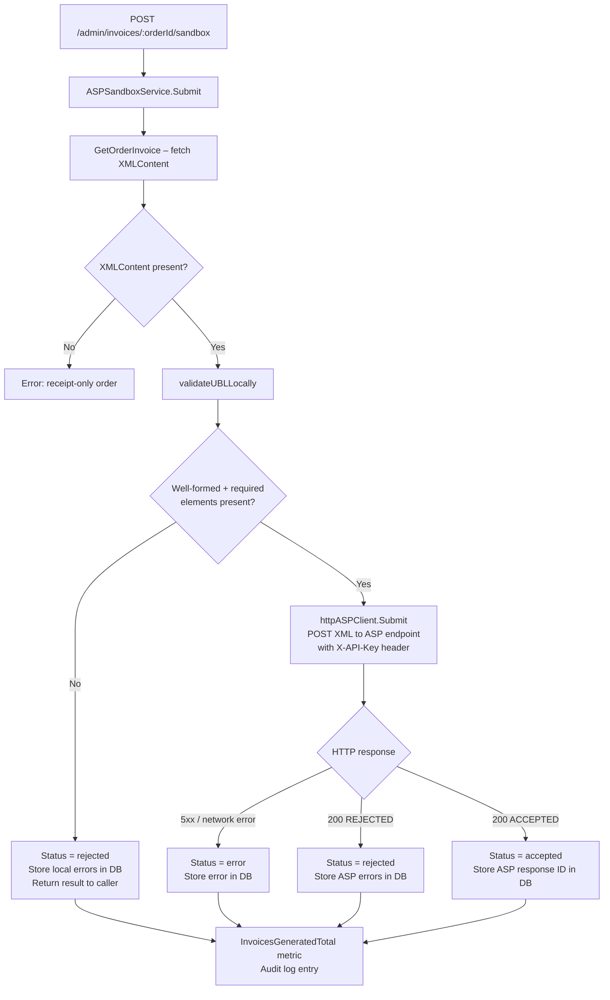
```mermaid
flowchart TD
    A[POST /admin/invoices/:orderId/sandbox] --> B[ASPSandboxService.Submit]
    B --> C[GetOrderInvoice – fetch XMLContent]
    C --> D{XMLContent present?}
    D -- No --> E[Error: receipt-only order]
    D -- Yes --> F[validateUBLLocally]
    F --> G{Well-formed + required\nelements present?}
    G -- No --> H[Status = rejected\nStore local errors in DB\nReturn result to caller]
    G -- Yes --> I[httpASPClient.Submit\nPOST XML to ASP endpoint\nwith X-API-Key header]
    I --> J{HTTP response}
    J -- 5xx / network error --> K[Status = error\nStore error in DB]
    J -- 200 REJECTED --> L[Status = rejected\nStore ASP errors in DB]
    J -- 200 ACCEPTED --> M[Status = accepted\nStore ASP response ID in DB]
    H & K & L & M --> N[InvoicesGeneratedTotal metric\nAudit log entry]
```

**Local pre-validation checks:**  
Before hitting the ASP endpoint, 11 mandatory UBL element names are verified
plus the UBL 2.1 Invoice namespace URI. This catches common errors (missing
`TaxTotal`, wrong namespace) with zero network cost.

**DB column:** `order_invoices.sandbox_status` (enum: `pending | accepted | rejected | error`)  
Fires `FireASPRejection` alert via `alerts.Manager` for rejections.

---

## Batch Import (China Shipments)

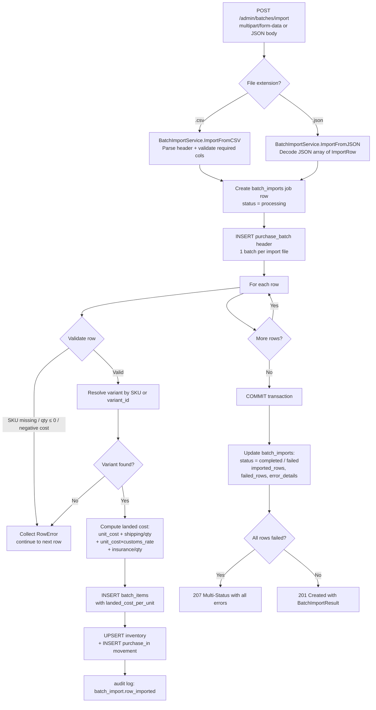
```mermaid
flowchart TD
    A[POST /admin/batches/import\nmultipart/form-data or JSON body] --> B{File extension?}
    B -- .csv --> C[BatchImportService.ImportFromCSV\nParse header + validate required cols]
    B -- .json --> D[BatchImportService.ImportFromJSON\nDecode JSON array of ImportRow]
    C & D --> E[Create batch_imports job row\nstatus = processing]
    E --> F[INSERT purchase_batch header\n1 batch per import file]
    F --> G[For each row]
    G --> H{Validate row}
    H -- SKU missing / qty ≤ 0 / negative cost --> I[Collect RowError\ncontinue to next row]
    H -- Valid --> J[Resolve variant by SKU or variant_id]
    J --> K{Variant found?}
    K -- No --> I
    K -- Yes --> L[Compute landed cost:\nunit_cost + shipping/qty\n+ unit_cost×customs_rate\n+ insurance/qty]
    L --> M[INSERT batch_items\nwith landed_cost_per_unit]
    M --> N[UPSERT inventory\n+ INSERT purchase_in movement]
    N --> O[audit log: batch_import.row_imported]
    G --> P{More rows?}
    P -- Yes --> G
    P -- No --> Q[COMMIT transaction]
    Q --> R[Update batch_imports:\nstatus = completed / failed\nimported_rows, failed_rows, error_details]
    R --> S{All rows failed?}
    S -- Yes --> T[207 Multi-Status with all errors]
    S -- No --> U[201 Created with BatchImportResult]
```

**CSV column schema:**

| Column | Required | Example |
|--------|----------|---------|
| `sku` | ✓ | `DRESS-RED-S-001` |
| `quantity` | ✓ | `500` |
| `unit_cost` | ✓ | `45.00` |
| `shipping_total` | ✓ | `2500.00` |
| `customs_duty_rate` | ✓ | `0.05` |
| `insurance_total` | ✓ | `750.00` |
| `variant_id` | optional | UUID |
| `notes` | optional | Free text |

**Idempotency:** The `batch_imports` table records every import with its filename,
importer, and error log. Re-importing the same file creates a new batch (not
deduplicated), so callers should use unique filenames (e.g. include date).

---

## Alerting Rules & Prometheus Integration

Alerts are defined in `deployments/prometheus/rules/dubai_retail_alerts.yml`
and delivered via Alertmanager → Slack webhooks.

| Alert | Condition | Severity | Team |
|-------|-----------|----------|------|
| `LowStockVariant` | `stock_level < 10` for 2m | warning | operations |
| `StockoutVariant` | `stock_level == 0` for 5m | **critical** | operations |
| `HighOrderFailureRate` | failure rate > 5% over 5m | warning | engineering |
| `InsufficientStockErrors` | rate > 0.1/s for 5m | warning | operations |
| `PendingInvoicesAccumulating` | `pending_invoices > 0` for 5m | **critical** | compliance |
| `ASPSandboxRejections` | > 5 rejections/hour | warning | compliance |
| `QCPhotoMismatchSpike` | > 3 mismatches/hour | warning | operations |
| `HighAbandonedCartRate` | reservation expiry > 0.5/s for 5m | info | product |

**Inhibit rule:** `StockoutVariant` suppresses `LowStockVariant` for the same variant.

**Internal `alerts.Manager`:** Services can fire immediate alerts (without waiting
for Prometheus scrape) via:

```go
alertMgr.FireLowStock(ctx, variantID, sku, qty)
alertMgr.FireQCMismatch(ctx, returnItemID, variantID)
alertMgr.FireASPRejection(ctx, orderID, invoiceID, errors)
alertMgr.FireFraudSignal(ctx, email, reason, count)
```

Each call emits a `zap.Warn("alert.fired", ...)` log entry AND posts to the
corresponding Slack channel asynchronously (non-blocking goroutine).

---

## Analytics Module

All analytics are read-only and served from `GET /admin/analytics/*`.

```mermaid
flowchart TD
    A[GET /admin/analytics/forecast?sku=X&channel=Y] --> B[AnalyticsService.ForecastDemand]
    B --> C[GetWeeklySalesByVariant\nlast 4 ISO weeks from order_items]
    C --> D[Weighted Moving Average\nweek-1=4× week-2=3× week-3=2× week-4=1×]
    D --> E[weekly_forecast = weighted_sum / 10]
    E --> F[GetAllVariantsWithStock → current_stock]
    F --> G[days_of_stock = current_stock / daily_forecast]
    G --> H{days_of_stock < 14?}
    H -- Yes --> I[reorder_suggested = true]
    H -- No --> J[reorder_suggested = false]

    K[GET /admin/analytics/reorder] --> L[SuggestReorders\nfor every active variant]
    L --> M[ForecastDemand per variant]
    M --> N{reorder_suggested?}
    N -- Yes --> O[SuggestedQty = weekly_forecast × 4\nPriority: urgent < 3d, high < 7d, medium < 14d]

    P[GET /admin/analytics/promotions] --> Q[GetPromotionStats\nlast 90 days from price_promotions JOIN order_items]
    Q --> R[Compute RevenueLift, DiscountDepth, Verdict\nVerdict: effective / neutral / costly]

    S[GET /admin/analytics/fraud] --> T[GetCustomerReturnStats\nlast 30 days]
    T --> U{return_rate > 40% AND QC mismatches\nOR total_returns > 5}
    U -- Yes --> V[FraudSignal{risk_level, reason}]
    V --> W[alerts.Manager.FireFraudSignal]
```

**Forecast algorithm:** 4-week weighted moving average  
`forecast = (week[-4]×1 + week[-3]×2 + week[-2]×3 + week[-1]×4) / 10`

**Confidence:** `high` (4 weeks data) · `medium` (2–3 weeks) · `low` (< 2 weeks)

**Fraud signals:**
- High risk: return_rate > 40% + QC mismatches, OR > 5 returns/30 days
- Medium risk: return_rate > 25% across > 2 orders

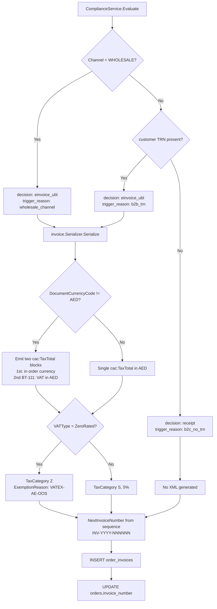
```mermaid
flowchart TD
    A[ComplianceService.Evaluate] --> B{Channel = WHOLESALE?}
    B -- Yes --> C[decision: einvoice_ubl\ntrigger_reason: wholesale_channel]
    B -- No --> D{customer TRN present?}
    D -- Yes --> E[decision: einvoice_ubl\ntrigger_reason: b2b_trn]
    D -- No --> F[decision: receipt\ntrigger_reason: b2c_no_trn]

    C & E --> G[invoice.Serializer.Serialize]
    G --> H{DocumentCurrencyCode != AED?}
    H -- Yes --> I[Emit two cac:TaxTotal blocks\n1st: in order currency\n2nd BT-111: VAT in AED]
    H -- No --> J[Single cac:TaxTotal in AED]
    I & J --> K{VATType = ZeroRated?}
    K -- Yes --> L[TaxCategory Z\nExemptionReason: VATEX-AE-OOS]
    K -- No --> M[TaxCategory S, 5%]

    F --> N[No XML generated]

    L & M & N --> O[NextInvoiceNumber from sequence\nINV-YYYY-NNNNNN]
    O --> P[INSERT order_invoices]
    P --> Q[UPDATE orders.invoice_number]
```

**51 mandatory PINT-AE fields** are all covered. Key ones:

| Field | Source |
|-------|--------|
| `cbc:ID` | `invoice_number_seq` → `INV-YYYY-NNNNNN` |
| `cbc:UUID` | `orders.id` |
| `cbc:IssueDate` | Order `created_at` |
| Seller TIN | First 10 digits of `SELLER_TRN` env var |
| Buyer TRN | `orders.customer_trn` |
| `BT-111` VAT in AED | `VATAmountAED` on each order_item × exchange rate |
| Arabic item name | `OrderItem.DescriptionAR` |

---

## RMA / Returns Flow

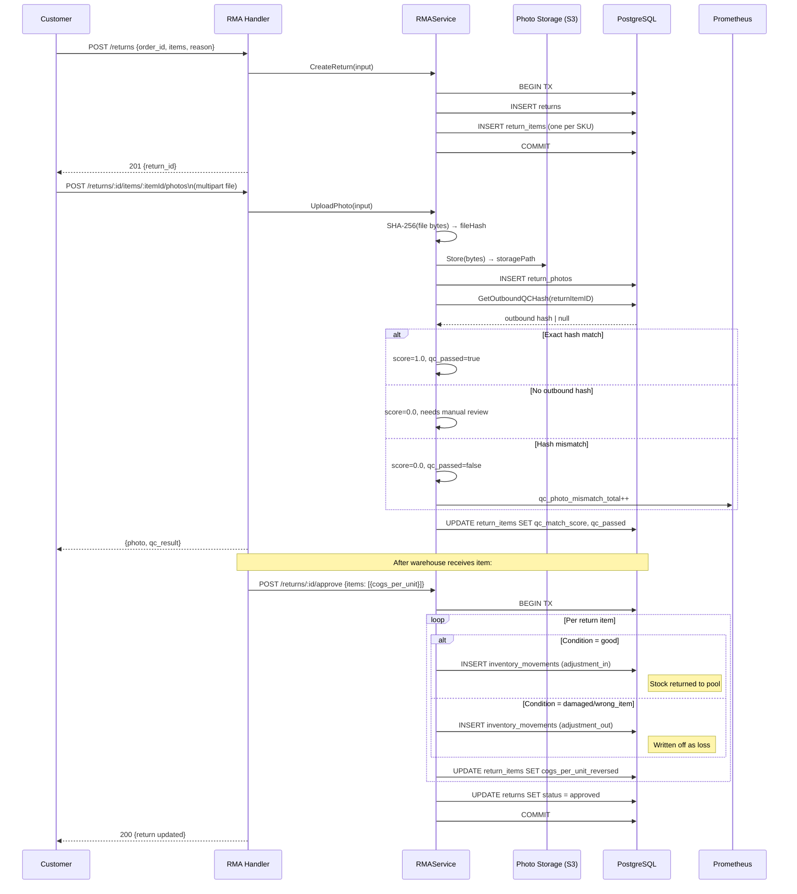
```mermaid
sequenceDiagram
    participant Customer
    participant Handler as RMA Handler
    participant RMAService
    participant Storage as Photo Storage (S3)
    participant DB as PostgreSQL

    Customer->>Handler: POST /returns {order_id, items, reason}
    Handler->>RMAService: CreateReturn(input)
    RMAService->>DB: BEGIN TX
    RMAService->>DB: INSERT returns
    RMAService->>DB: INSERT return_items (one per SKU)
    RMAService->>DB: COMMIT
    Handler-->>Customer: 201 {return_id}

    Customer->>Handler: POST /returns/:id/items/:itemId/photos\n(multipart file)
    Handler->>RMAService: UploadPhoto(input)
    RMAService->>RMAService: SHA-256(file bytes) → fileHash
    RMAService->>Storage: Store(bytes) → storagePath
    RMAService->>DB: INSERT return_photos
    RMAService->>DB: GetOutboundQCHash(returnItemID)
    DB-->>RMAService: outbound hash | null

    alt Exact hash match
        RMAService->>RMAService: score=1.0, qc_passed=true
    else No outbound hash
        RMAService->>RMAService: score=0.0, needs manual review
    else Hash mismatch
        RMAService->>RMAService: score=0.0, qc_passed=false
        RMAService->>Prometheus: qc_photo_mismatch_total++
    end

    RMAService->>DB: UPDATE return_items SET qc_match_score, qc_passed
    Handler-->>Customer: {photo, qc_result}

    Note over Handler, DB: After warehouse receives item:
    Handler->>RMAService: POST /returns/:id/approve {items: [{cogs_per_unit}]}
    RMAService->>DB: BEGIN TX
    loop Per return item
        alt Condition = good
            RMAService->>DB: INSERT inventory_movements (adjustment_in)
            Note right of DB: Stock returned to pool
        else Condition = damaged/wrong_item
            RMAService->>DB: INSERT inventory_movements (adjustment_out)
            Note right of DB: Written off as loss
        end
        RMAService->>DB: UPDATE return_items SET cogs_per_unit_reversed
    end
    RMAService->>DB: UPDATE returns SET status = approved
    RMAService->>DB: COMMIT
    Handler-->>Customer: 200 {return updated}
```

---

## Background Worker Jobs

| Job | Schedule | Queue | Description |
|-----|----------|-------|-------------|
| `reservation:cleanup_expired` | Every 1 min | critical | Finds `is_active=TRUE AND expires_at < NOW()` reservations, calls `ReleaseExpiredReservations`, increments `reservations_expired_total` metric |
| `metrics:refresh_gauges` | Every 30 s | low | Updates `active_reservations` and `pending_invoices` Prometheus gauges |
| `inventory:low_stock_check` | Every 5 min | low | Scans variants at or below `reorder_point`, logs alerts |
| `reservation:release` | On-demand | critical | Manually triggered release for specific reservation IDs |

---

## VAT Calculation Rules

```
┌─────────────────────────────────────────────────────────────────┐
│  VATType = standard  (domestic / GCC)                          │
│                                                                 │
│  NetPrice    = ChannelPrice (excl. VAT)                        │
│  VATRate     = 5%                                              │
│  VATAmount   = NetPrice × 0.05                                 │
│  GrossPrice  = NetPrice × 1.05                                 │
│  VATAmountAED = VATAmount × ExchangeRateToAED                  │
│                                                                 │
├─────────────────────────────────────────────────────────────────┤
│  VATType = zero_rated  (exports, designated zones)             │
│                                                                 │
│  NetPrice    = ChannelPrice                                    │
│  VATRate     = 0%                                              │
│  VATAmount   = 0                                               │
│  GrossPrice  = NetPrice                                        │
│  VATAmountAED = 0                                              │
│  UBL TaxCategory = Z, ExemptionCode = VATEX-AE-OOS            │
│                                                                 │
├─────────────────────────────────────────────────────────────────┤
│  Dual-Currency (BT-111 compliance)                             │
│                                                                 │
│  If DocumentCurrencyCode != AED:                               │
│    → First  cac:TaxTotal: VATAmount in order currency          │
│    → Second cac:TaxTotal: VATAmount × ExchangeRateToAED (AED) │
│  If DocumentCurrencyCode = AED:                                │
│    → Single cac:TaxTotal in AED                               │
└─────────────────────────────────────────────────────────────────┘
```

---

## COGS & Landed Cost Engine

```
landed_cost_per_unit =
    unit_cost
  + (shipping_total / units_in_batch)
  + (unit_cost × customs_duty_rate)     ← 5% UAE customs by default
  + (insurance_total / units_in_batch)
```

This is stored as a `GENERATED ALWAYS AS (...) STORED` column on `batch_items`
so it is always consistent with the batch's financial data and cannot be
accidentally overwritten.

When FIFO deducts from a batch, it copies `landed_cost_per_unit` into:
- `inventory_movements.cogs_per_unit` (immutable ledger row)  
- `order_items.cogs_per_unit` (per-order line)

**Profit margin** = `unit_price_net - cogs_per_unit`

---

## Multi-Channel Price Resolution

```
PriceResolver.Resolve(variantID, channelID, customerTier)

Priority (waterfall):
  1. Tier-specific active promotion
     WHERE variant_id = ? AND channel_id = ? AND customer_tier = tier
       AND is_active = TRUE AND now BETWEEN effective_from AND effective_until
     ORDER BY promo_price ASC   ← cheapest promotion wins

  2. General active promotion (tier = NULL = any tier)
     Same conditions, customer_tier IS NULL

  3. Standard channel_prices row
     WHERE variant_id = ? AND channel_id = ?

  → PriceResult {NetPrice, VATAmount, GrossPrice, VATAmountAED, PriceSource, PromotionID}
```

`PriceSource` is either `"standard"` or `"promotion"`. The `PromotionID` is
recorded on `order_items` for audit and promotion-performance reporting.

---

## Monitoring & Alerts

Access the Grafana dashboard at **http://localhost:3001** (admin / dubai_grafana).

Key panels:
- **Orders/hour by channel** — tracks sales velocity
- **Pending Invoices (Compliance Gap)** — should always be 0 in steady state
- **QC Photo Mismatches** — non-zero value triggers fraud review
- **Order Failures by Reason** — `insufficient_stock` spikes indicate stock-outs

Prometheus scrape endpoint: `http://localhost:9091/metrics`

---

## Transaction Isolation Strategy

| Operation | Isolation Level | Why |
|-----------|-----------------|-----|
| `SubtractStock` (FIFO) | `SERIALIZABLE` | Prevents phantom reads on batch_items; two concurrent orders on the same SKU cannot both see the same stock |
| `ProcessOrder` writes (INSERT orders, INSERT order_items, compliance) | `READ COMMITTED` | Allows higher throughput for order writes; stock has already been atomically deducted |
| `ReserveStock` | `READ COMMITTED` with `SELECT FOR UPDATE` | Prevents double-reservation of the same units |
| `ReleaseExpiredReservations` | `READ COMMITTED` | Simple idempotent update |
| `CreateReturn` / `ApproveReturn` | `READ COMMITTED` | RMA writes are not concurrency-sensitive |

**Compensation pattern:** If the `READ COMMITTED` order-write transaction fails
after `SubtractStock` has already committed, a `compensate()` function logs a
`MANUAL_RECONCILIATION_REQUIRED` error with the affected SKUs and quantities
so ops staff can restore stock manually or via admin tool.

---

## Environment Variables

| Variable | Default | Description |
|----------|---------|-------------|
| `DATABASE_URL` | — | PostgreSQL DSN |
| `REDIS_URL` | — | Redis DSN |
| `VAT_RATE` | `0.05` | Output VAT rate (5% UAE) |
| `CURRENCY` | `AED` | Default invoice currency |
| `RESERVATION_TTL_S` | `900` | Stock reservation lifetime (15 min) |
| `SELLER_TRN` | — | 15-digit UAE Tax Registration Number |
| `SELLER_NAME` | — | English legal name for UBL invoices |
| `SELLER_NAME_AR` | — | Arabic legal name |
| `SELLER_TRADE_LICENSE` | — | UAE Trade License number |
| `SELLER_GLN` | — | Global Location Number (UBL endpoint ID) |
| `SELLER_STREET` | — | Address street line |
| `SELLER_CITY` | — | City (Dubai) |
| `SELLER_EMAIL` | — | Accounts e-mail for invoices |
| `PAYMENT_GATEWAY_DEFAULT` | `stripe` | Default payment processor |
| `PAYMENT_GATEWAY_FALLBACK` | `network_international` | Fallback processor |
| `GRAFANA_USER` | `admin` | Grafana login |
| `GRAFANA_PASSWORD` | — | Grafana password |

---

## 11. Authentication & RBAC

### 11.1 Auth Flow

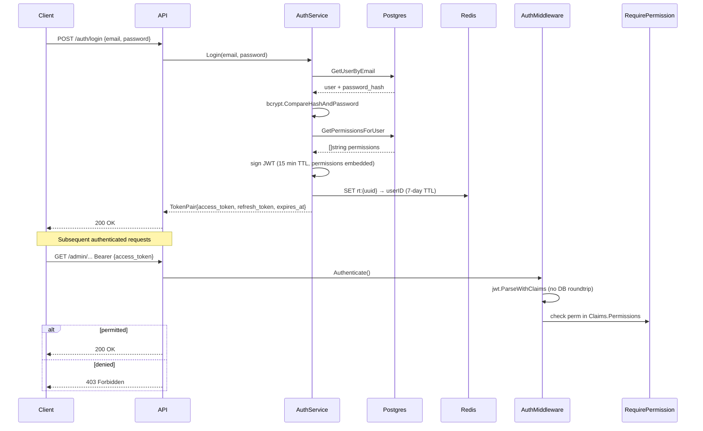
```mermaid
sequenceDiagram
    participant Client
    participant API
    participant AuthService
    participant Postgres
    participant Redis

    Client->>API: POST /auth/login {email, password}
    API->>AuthService: Login(email, password)
    AuthService->>Postgres: GetUserByEmail
    Postgres-->>AuthService: user + password_hash
    AuthService->>AuthService: bcrypt.CompareHashAndPassword
    AuthService->>Postgres: GetPermissionsForUser
    Postgres-->>AuthService: []string permissions
    AuthService->>AuthService: sign JWT (15 min TTL, permissions embedded)
    AuthService->>Redis: SET rt:{uuid} → userID  (7-day TTL)
    AuthService-->>API: TokenPair{access_token, refresh_token, expires_at}
    API-->>Client: 200 OK

    Note over Client,API: Subsequent authenticated requests
    Client->>API: GET /admin/... Bearer {access_token}
    API->>AuthMiddleware: Authenticate()
    AuthMiddleware->>AuthMiddleware: jwt.ParseWithClaims (no DB roundtrip)
    AuthMiddleware->>RequirePermission: check perm in Claims.Permissions
    alt permitted
        API-->>Client: 200 OK
    else denied
        API-->>Client: 403 Forbidden
    end
```

### 11.2 RBAC Role Matrix

| Role | Key Permissions |
|------|----------------|
| `admin` | All |
| `manager` | products, orders, inventory, returns, analytics, pricing, suppliers |
| `warehouse` | products.read, inventory.manage, returns.approve, suppliers.manage |
| `cashier` | products.read, orders.manage |
| `finance` | analytics.view, invoices.sandbox, orders.manage |

### 11.3 Token Storage

- **Access token**: Short-lived JWT (15 min), self-contained permissions — no DB call per request.
- **Refresh token**: Opaque UUID stored in Redis as `rt:{tokenID}` with 7-day TTL. Rotation on every refresh (old token immediately deleted).

---

## 12. Supplier Module (Minimal Procurement)

### 12.1 Purchase Order → Inventory Flow

```mermaid
flowchart TD
    A[POST /admin/suppliers] --> B[(suppliers table)]
    C[POST /admin/purchase-orders] --> D[(purchase_orders table)]
    E[POST /admin/purchase-orders/{id}/items] --> F[(purchase_order_items table)]
    G[POST /admin/purchase-orders/{id}/receive] --> H{SupplierService.ReceivePurchaseOrder}
    H --> I[Compute landed cost per unit]
    H --> J[INSERT purchase_batches]
    H --> K[INSERT batch_items per PO item]
    H --> L[UpsertInventory - quantity_on_hand += qty]
    H --> M[INSERT inventory_movements type=purchase_in]
    H --> N[UPDATE purchase_order status=received]
    I --> K
```

### 12.2 Landed Cost Calculation on Receive

```
landed_cost = unit_cost
            + (shipping_total / total_units)
            + (unit_cost × customs_duty_pct)
            + (insurance_total / total_units)
```

This mirrors the existing BatchImport landed cost formula, ensuring COGS consistency.

### 12.3 Supplier Impact on System

- `supplier_id` on `purchase_batches` is **nullable** — existing batch import and manual flows remain unchanged.
- `ReceivePurchaseOrder` reuses `BatchImportRepository` to avoid duplicating batch persistence logic.
- All writes are wrapped in a single `ReadCommitted` transaction.

---

## 13. Omnichannel Sync System

### 13.1 Architecture

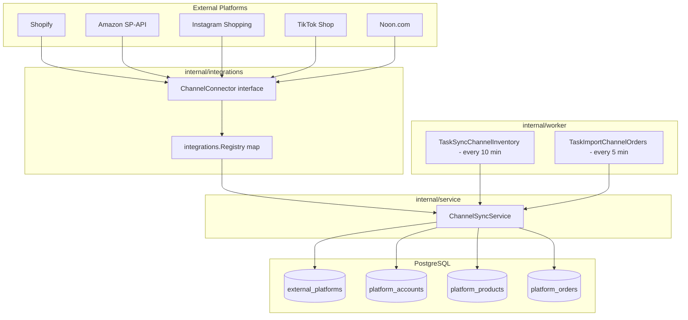
```mermaid
flowchart TD
    subgraph External Platforms
        SH[Shopify]
        AM[Amazon SP-API]
        IG[Instagram Shopping]
        TT[TikTok Shop]
        NO[Noon.com]
    end

    subgraph internal/integrations
        CONN[ChannelConnector interface]
        SREG[integrations.Registry map]
    end

    subgraph internal/service
        CSS[ChannelSyncService]
    end

    subgraph internal/worker
        WI[TaskSyncChannelInventory - every 10 min]
        WO[TaskImportChannelOrders - every 5 min]
    end

    subgraph PostgreSQL
        EP[(external_platforms)]
        PA[(platform_accounts)]
        PP[(platform_products)]
        PO[(platform_orders)]
    end

    SH --> CONN
    AM --> CONN
    IG --> CONN
    TT --> CONN
    NO --> CONN
    CONN --> SREG
    SREG --> CSS
    CSS --> EP
    CSS --> PA
    CSS --> PP
    CSS --> PO
    WI --> CSS
    WO --> CSS
```

### 13.2 Inventory Sync Pipeline

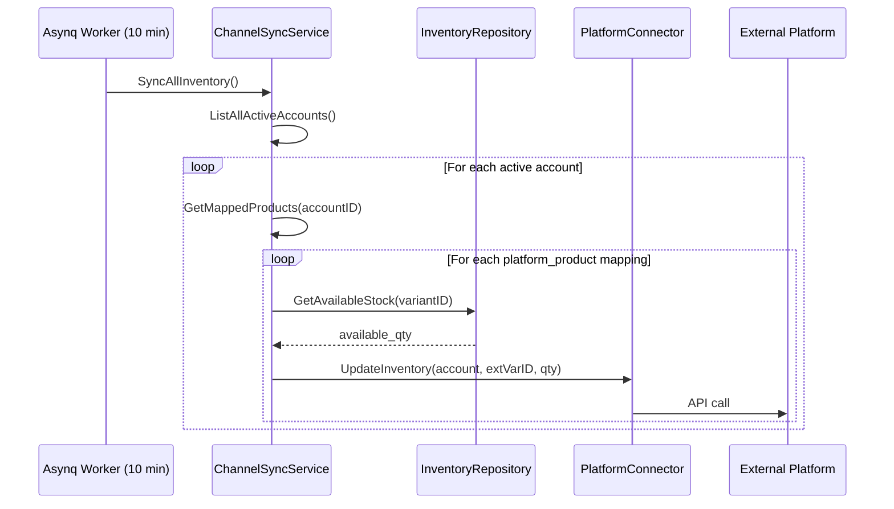
```mermaid
sequenceDiagram
    participant Worker as Asynq Worker (10 min)
    participant SyncSvc as ChannelSyncService
    participant InvRepo as InventoryRepository
    participant Connector as PlatformConnector
    participant Platform as External Platform

    Worker->>SyncSvc: SyncAllInventory()
    SyncSvc->>SyncSvc: ListAllActiveAccounts()
    loop For each active account
        SyncSvc->>SyncSvc: GetMappedProducts(accountID)
        loop For each platform_product mapping
            SyncSvc->>InvRepo: GetAvailableStock(variantID)
            InvRepo-->>SyncSvc: available_qty
            SyncSvc->>Connector: UpdateInventory(account, extVarID, qty)
            Connector->>Platform: API call
        end
    end
```

### 13.3 Order Import Pipeline

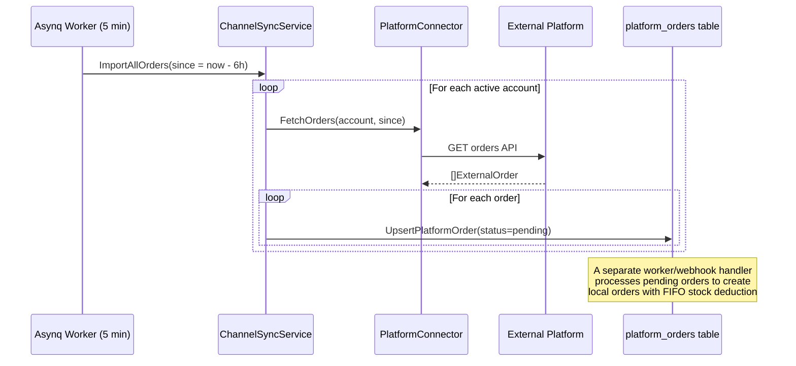
```mermaid
sequenceDiagram
    participant Worker as Asynq Worker (5 min)
    participant SyncSvc as ChannelSyncService
    participant Connector as PlatformConnector
    participant Platform as External Platform
    participant PlatformOrders as platform_orders table

    Worker->>SyncSvc: ImportAllOrders(since = now - 6h)
    loop For each active account
        SyncSvc->>Connector: FetchOrders(account, since)
        Connector->>Platform: GET orders API
        Platform-->>Connector: []ExternalOrder
        loop For each order
            SyncSvc->>PlatformOrders: UpsertPlatformOrder(status=pending)
        end
    end
    Note over PlatformOrders: A separate worker/webhook handler<br/>processes pending orders to create<br/>local orders with FIFO stock deduction
```

### 13.4 Connector Interface

```go
type ChannelConnector interface {
    PlatformName() string
    PublishProduct(ctx, account, variant, price, currency) error
    UpdateInventory(ctx, account, externalVariantID, qty) error
    UpdatePrice(ctx, account, externalVariantID, price, currency) error
    FetchOrders(ctx, account, since) ([]ExternalOrder, error)
}
```

Connectors are registered via `init()` in each adapter package. Import them into `main.go` with blank imports:

```go
_ "github.com/dubai-retail/os/internal/integrations/shopify"
_ "github.com/dubai-retail/os/internal/integrations/amazon"
```

### 13.5 Module Enable/Disable

The entire channel module is **disabled by default** — no platform accounts means all sync workers return immediately with no side-effects. Connect a platform via `POST /admin/channels/connect` to enable it.

---

## 14. RBAC Token Invalidation

### 14.1 Problem

JWT access tokens embed the user's permissions at issuance time. Because `ValidateAccessToken` is a stateless cryptographic check, a token issued before a role change remains valid until its 15-minute TTL expires, even if the user's access was revoked.

### 14.2 Solution: Permission Versioning

A monotonically incrementing `permissions_version` integer is stored per user in the `users` table. This value is:

1. **Embedded** in every JWT access token as the `pv` claim at issuance time.
2. **Verified** on every authenticated request by comparing the token's `pv` against the authoritative value (Redis cache → DB fallback).
3. **Incremented** atomically in the DB whenever a role is assigned to or removed from a user, then the Redis cache key is deleted.

A version mismatch causes an immediate `401 Unauthorized` with the message `"permissions changed, please re-login"`.

### 14.3 Flow Diagram

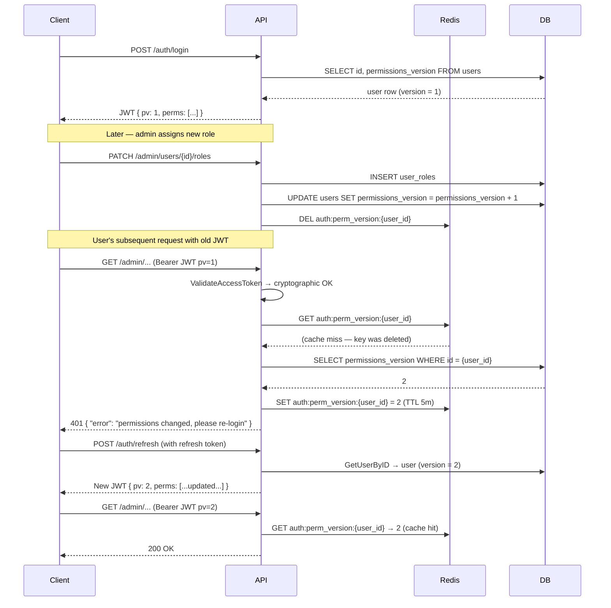
```mermaid
sequenceDiagram
    participant Client
    participant API
    participant Redis
    participant DB

    Client->>API: POST /auth/login
    API->>DB: SELECT id, permissions_version FROM users
    DB-->>API: user row (version = 1)
    API-->>Client: JWT { pv: 1, perms: [...] }

    Note over Client,API: Later — admin assigns new role

    Client->>API: PATCH /admin/users/{id}/roles
    API->>DB: INSERT user_roles
    API->>DB: UPDATE users SET permissions_version = permissions_version + 1
    API->>Redis: DEL auth:perm_version:{user_id}

    Note over Client,API: User's subsequent request with old JWT

    Client->>API: GET /admin/... (Bearer JWT pv=1)
    API->>API: ValidateAccessToken → cryptographic OK
    API->>Redis: GET auth:perm_version:{user_id}
    Redis-->>API: (cache miss — key was deleted)
    API->>DB: SELECT permissions_version WHERE id = {user_id}
    DB-->>API: 2
    API->>Redis: SET auth:perm_version:{user_id} = 2 (TTL 5m)
    API-->>Client: 401 { "error": "permissions changed, please re-login" }

    Client->>API: POST /auth/refresh (with refresh token)
    API->>DB: GetUserByID → user (version = 2)
    API-->>Client: New JWT { pv: 2, perms: [...updated...] }

    Client->>API: GET /admin/... (Bearer JWT pv=2)
    API->>Redis: GET auth:perm_version:{user_id} → 2 (cache hit)
    API-->>Client: 200 OK
```

### 14.4 Redis Cache Strategy

| Key | Value | TTL | Invalidated by |
|-----|-------|-----|----------------|
| `auth:perm_version:{user_id}` | integer version | 5 minutes | `AssignRole`, `RemoveRole` |

- **Cache hit**: Redis returns the version integer in O(1) — no DB call on most requests.
- **Cache miss**: DB is queried once and the result is cached.
- **Failure mode**: If Redis is unavailable, the system falls back to the DB for every request. If the DB is also unavailable, the check fails closed (401 returned).

### 14.5 Components

| Component | File | Change |
|-----------|------|--------|
| DB migration | `migrations/008_permission_version.sql` | Adds `permissions_version INT NOT NULL DEFAULT 1` to `users` |
| Domain | `internal/domain/auth.go` | `User.PermissionsVersion int` field |
| JWT Claims | `internal/service/auth.go` | `Claims.PermissionsVersion` (`pv` JSON key) |
| Token issuance | `internal/service/auth.go` `issueTokenPair` | Embeds `PermissionsVersion` from user record |
| Version checker | `internal/service/auth.go` `CheckPermissionVersion` | Redis-cached DB lookup, returns `ErrPermissionsChanged` |
| Cache bust | `internal/service/auth.go` `bustPermissionsCache` | DEL Redis key on RBAC mutation |
| RBAC mutations | `internal/service/auth.go` `AssignRole` / `RemoveRole` | Increment version + bust cache |
| Middleware | `internal/middleware/auth.go` `Authenticate` | Calls `CheckPermissionVersion` after JWT validation |
| Repository | `internal/repository/postgres/auth.go` | `GetPermissionsVersion`, `IncrementPermissionsVersion`, `RemoveRoleFromUser` |

### 14.6 API Behaviour After RBAC Change

| Scenario | Outcome |
|----------|---------|
| Token issued before role change, used after | `401 "permissions changed, please re-login"` |
| Token issued after role change | `200 OK` (new `pv` matches) |
| User calls `POST /auth/refresh` after role change | New token with updated `pv` and fresh permission list |
| Redis unavailable | DB fallback — correct behaviour, higher latency |
| DB unavailable (both stores down) | `401` — fails closed |

---

## 15. Global Auth Version (Emergency Revocation)

### 15.1 Problem

Per-user permission versioning (`pv`) handles normal RBAC changes. It doesn't help when you need to invalidate **every** token system-wide instantly — e.g. after a credential leak, a compromised signing key rotation, or a security incident.

### 15.2 Solution: Single Redis Key

A single Redis key `auth:global_version` stores a system-wide integer. It is:

- **Embedded** in every JWT as the `gav` (global_auth_version) claim at issuance time.
- **Checked** on every authenticated request **before** the per-user version check — it's a single `GET` against one Redis key, no per-user lookup.
- **Incremented** by calling `POST /admin/auth/revoke-all` (requires `users.manage` permission), which atomically runs `INCR auth:global_version`, invalidating every token in the system instantly.

### 15.3 Flow Diagram

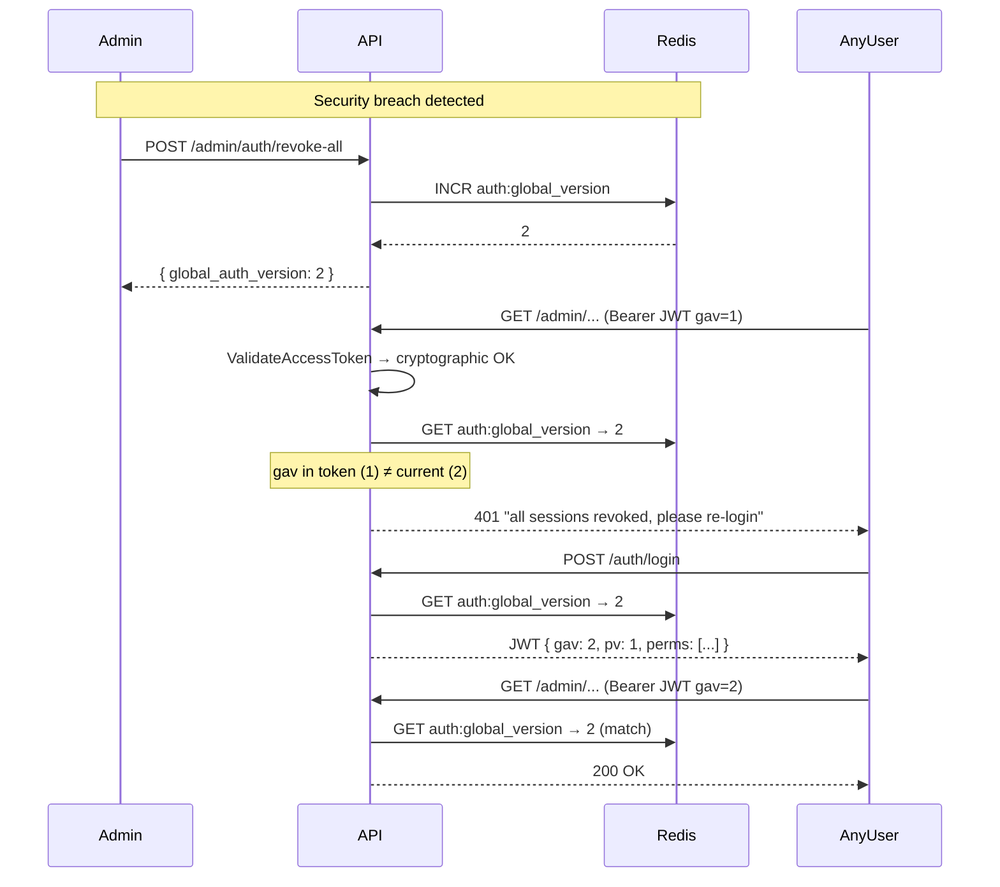
```mermaid
sequenceDiagram
    participant Admin
    participant API
    participant Redis
    participant AnyUser

    Note over Admin,Redis: Security breach detected

    Admin->>API: POST /admin/auth/revoke-all
    API->>Redis: INCR auth:global_version
    Redis-->>API: 2
    API-->>Admin: { global_auth_version: 2 }

    AnyUser->>API: GET /admin/... (Bearer JWT gav=1)
    API->>API: ValidateAccessToken → cryptographic OK
    API->>Redis: GET auth:global_version → 2
    Note over API: gav in token (1) ≠ current (2)
    API-->>AnyUser: 401 "all sessions revoked, please re-login"

    AnyUser->>API: POST /auth/login
    API->>Redis: GET auth:global_version → 2
    API-->>AnyUser: JWT { gav: 2, pv: 1, perms: [...] }

    AnyUser->>API: GET /admin/... (Bearer JWT gav=2)
    API->>Redis: GET auth:global_version → 2 (match)
    API-->>AnyUser: 200 OK
```

### 15.4 Middleware Check Order

On every authenticated request, `Authenticate` runs checks in this order:

```
1. JWT signature + expiry  (stateless — no I/O)
2. global auth version     (1× Redis GET on single key, O(1))
3. per-user perm version   (1× Redis GET per user, DB fallback)
```

The global check is intentionally first — it's cheaper and catches the most severe case (breach) before doing any per-user work.

### 15.5 Redis Key Behaviour

| State | Key value | Effect |
|---|---|---|
| Fresh deployment / key absent | `redis.Nil` → defaults to `1` | All tokens with `gav=1` are valid |
| Normal operation | `1` | Tokens embed `gav=1`; check passes |
| After first `revoke-all` | `2` | All tokens with `gav=1` are rejected |
| After second `revoke-all` | `3` | All tokens with `gav ≤ 2` are rejected |
| Redis restart (no AOF/RDB) | Key lost → defaults to `1` | Tokens re-validate; revocation is lost — configure Redis persistence |

> **Production note:** Configure Redis with AOF persistence (`appendonly yes`) so the global version survives a restart. Without persistence, a Redis restart implicitly re-validates all tokens.

### 15.6 Components

| Component | File | Change |
|---|---|---|
| JWT Claims | `internal/service/auth.go` | `Claims.GlobalAuthVersion` (`gav`) |
| Token issuance | `internal/service/auth.go` `issueTokenPair` | Reads current `gav` from Redis; falls back to `1` on error |
| Global checker | `internal/service/auth.go` `CheckGlobalAuthVersion` | Single Redis GET; fails closed on error |
| Revocation | `internal/service/auth.go` `RevokeAllTokens` | `INCR auth:global_version`; logs new version |
| Middleware | `internal/middleware/auth.go` `Authenticate` | Global check runs before per-user check |
| Handler | `internal/handler/http/router/auth_handler.go` `RevokeAll` | Returns new global version in response |
| Route | `internal/handler/http/router/router.go` | `POST /admin/auth/revoke-all` gated by `users.manage` |

### 15.7 Design Notes: Permissions in JWT

The `perms` array is intentionally **kept in the JWT** alongside `pv` and `gav`. This means:

- `RequirePermission` middleware is a **pure in-memory check** — zero I/O, zero latency.
- The version checks (`pv`, `gav`) ensure stale permissions can't persist beyond the next request.
- Removing `perms` from the token would require a Redis/DB lookup on every permission check, which adds latency on every `RequirePermission` call in every handler.

The trade-off is a slightly larger token (a few hundred bytes), which is negligible for admin API traffic.

---

## 16. POS System

### 16.1 Purpose

Support physical retail store checkout using the same inventory, pricing, and order pipeline as the ecommerce channel. A cashier scans barcodes, creates orders, accepts payment, and prints a receipt — all through dedicated POS API endpoints.

### 16.2 Database (migration 009)

| Table | Purpose |
|-------|---------|
| `pos_registers` | Physical terminals (e.g. "Checkout 1 – Ground Floor") |
| `pos_sessions` | Cashier shifts: register opened → closed, with opening and closing cash |
| `pos_payments` | One row per payment; supports `cash`, `card`, `split` |

The `channels` table already has a seeded `'pos'` type channel (`'POS Dubai Store'`). POS orders are standard `orders` rows with `channel_id` pointing to that channel.

### 16.3 POS Checkout Flow

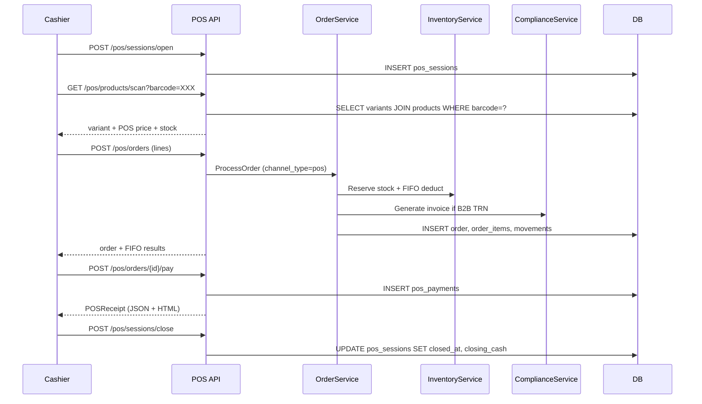
```mermaid
sequenceDiagram
    participant Cashier
    participant POS API
    participant OrderService
    participant InventoryService
    participant ComplianceService
    participant DB

    Cashier->>POS API: POST /pos/sessions/open
    POS API->>DB: INSERT pos_sessions

    Cashier->>POS API: GET /pos/products/scan?barcode=XXX
    POS API->>DB: SELECT variants JOIN products WHERE barcode=?
    POS API-->>Cashier: variant + POS price + stock

    Cashier->>POS API: POST /pos/orders (lines)
    POS API->>OrderService: ProcessOrder (channel_type=pos)
    OrderService->>InventoryService: Reserve stock + FIFO deduct
    OrderService->>ComplianceService: Generate invoice if B2B TRN
    OrderService->>DB: INSERT order, order_items, movements
    POS API-->>Cashier: order + FIFO results

    Cashier->>POS API: POST /pos/orders/{id}/pay
    POS API->>DB: INSERT pos_payments
    POS API-->>Cashier: POSReceipt (JSON + HTML)

    Cashier->>POS API: POST /pos/sessions/close
    POS API->>DB: UPDATE pos_sessions SET closed_at, closing_cash
```

### 16.4 API Endpoints

| Method | Path | Description |
|--------|------|-------------|
| `POST` | `/pos/sessions/open` | Start a cashier shift |
| `POST` | `/pos/sessions/close` | End a cashier shift |
| `GET` | `/pos/products/scan?barcode=` | Barcode lookup: variant + price + stock |
| `POST` | `/pos/orders` | Create a POS order (reuses OrderService pipeline) |
| `POST` | `/pos/orders/{id}/pay` | Record payment → returns receipt |
| `GET` | `/pos/orders/{id}/receipt` | Print HTML receipt |

All `/pos` routes require a valid JWT.

### 16.5 Receipt Generation

`ReceiptService.RenderHTML(receipt *domain.POSReceipt)` produces an 80mm-width printable HTML receipt from a built-in `html/template`. The receipt includes:

- Store name, register name, issued timestamp
- Line items: SKU, name, qty × unit price = line total
- Subtotal, discount, VAT (5%), **TOTAL**
- Payment method, amount paid, change

A JSON-serialisable `domain.POSReceipt` struct is also returned so the POS terminal can render its own display format.

### 16.6 Key Files

| File | Role |
|------|------|
| `migrations/009_pos.sql` | Schema + default register seed |
| `internal/domain/pos.go` | POSRegister, POSSession, POSPayment, BarcodeResult, POSReceipt |
| `internal/repository/postgres/pos.go` | POSRepository |
| `internal/service/pos.go` | POSService, OpenSession, CloseSession, ScanBarcode, CreatePOSOrder, RecordPayment |
| `internal/service/receipt.go` | ReceiptService HTML/JSON renderer |
| `internal/handler/http/router/pos_handler.go` | HTTP handlers |
| `internal/service/pos_test.go` | Unit tests (fake repo + fake OrderQuerier) |

---

## 17. Shipping / Fulfillment

### 17.1 Purpose

Manage outbound shipments from order to delivery. Carrier adapters (Aramex, DHL, Emirates Post) plug into a `ShippingConnector` interface — the same pluggable registry pattern used by the omnichannel module.

### 17.2 Database (migration 010)

| Table | Purpose |
|-------|---------|
| `shipping_providers` | Immutable carrier registry (seeded: Aramex active, DHL + Emirates Post inactive) |
| `shipping_accounts` | Per-store API credentials for each provider (JSONB settings) |
| `shipments` | One shipment per fulfillable order; tracks `tracking_number` and `status` |
| `shipment_events` | Immutable tracking event log (carrier status pushes) |

`shipment_status` enum: `pending → booked → picked_up → in_transit → out_for_delivery → delivered`

### 17.3 Shipment Lifecycle

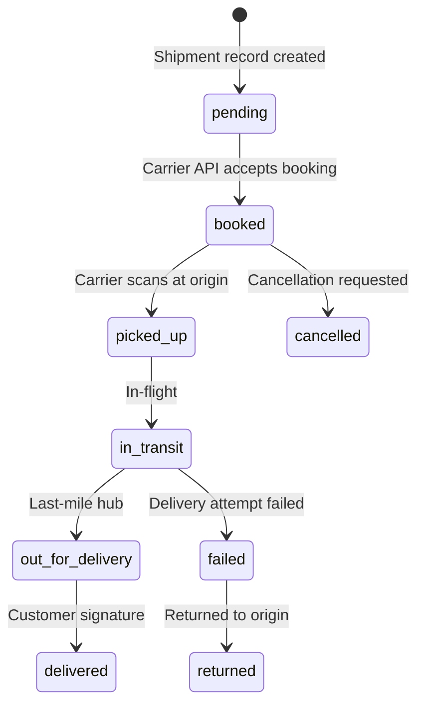
```mermaid
stateDiagram-v2
    [*] --> pending : Shipment record created
    pending --> booked : Carrier API accepts booking
    booked --> picked_up : Carrier scans at origin
    picked_up --> in_transit : In-flight
    in_transit --> out_for_delivery : Last-mile hub
    out_for_delivery --> delivered : Customer signature
    booked --> cancelled : Cancellation requested
    in_transit --> failed : Delivery attempt failed
    failed --> returned : Returned to origin
```

### 17.4 Connector Architecture

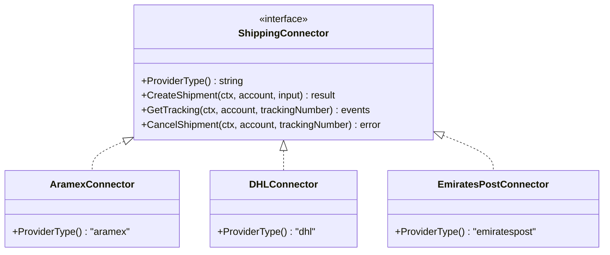
```mermaid
classDiagram
    class ShippingConnector {
        <<interface>>
        +ProviderType() string
        +CreateShipment(ctx, account, input) result
        +GetTracking(ctx, account, trackingNumber) events
        +CancelShipment(ctx, account, trackingNumber) error
    }
    class AramexConnector { +ProviderType() "aramex" }
    class DHLConnector { +ProviderType() "dhl" }
    class EmiratesPostConnector { +ProviderType() "emiratespost" }
    ShippingConnector <|.. AramexConnector
    ShippingConnector <|.. DHLConnector
    ShippingConnector <|.. EmiratesPostConnector
```

Connectors are registered in `init()` via `shipping.Register(c)`. The registry is keyed by `ProviderType()` string. Production code selects the connector from the live database account's `provider_type` setting.

**Aramex** is implemented as a real HTTP client targeting the Aramex Rate+Ship JSON API (sandbox by default). **DHL** and **Emirates Post** are stubs that return a helpful error message until credentials are configured.

### 17.5 Background Worker

| Asynq Task | Schedule | Description |
|------------|----------|-------------|
| `shipping.sync_tracking` | Every 15 min | Calls `GetTracking` for all in-transit shipments; appends new events; advances status on delivery |
| `shipping.create_shipment` | On-demand | Enqueued when an order is paid and ready to ship |

### 17.6 API Endpoints

| Method | Path | Permission Required |
|--------|------|---------------------|
| `POST` | `/admin/shipments/create` | `inventory.manage` |
| `GET` | `/admin/shipments/{id}` | `inventory.manage` |
| `GET` | `/admin/shipments/{id}/tracking` | `inventory.manage` |
| `POST` | `/admin/shipping/accounts` | `inventory.manage` |

### 17.7 Key Files

| File | Role |
|------|------|
| `migrations/010_shipping.sql` | Schema + provider seed |
| `internal/domain/shipping.go` | Shipment, ShippingProvider, ShippingAccount, ShipmentEvent |
| `internal/integrations/shipping/connector.go` | ShippingConnector interface + registry + MockConnector |
| `internal/integrations/shipping/aramex/aramex.go` | Aramex HTTP implementation |
| `internal/integrations/shipping/dhl/dhl.go` | DHL stub |
| `internal/integrations/shipping/emiratespost/emiratespost.go` | Emirates Post stub |
| `internal/repository/postgres/shipping.go` | ShippingRepository |
| `internal/service/shipping.go` | ShippingService |
| `internal/handler/http/router/shipping_handler.go` | HTTP handlers |
| `internal/service/shipping_test.go` | Unit tests (fake repo + MockConnector) |

---

## 18. SaaS Multi-Tenant Architecture

### 18.1 Purpose

Allow the platform to serve multiple fully-isolated stores on a single deployment, without breaking existing single-store setups.

### 18.2 Design Principles

1. **Backward compatible** — a `default tenant` (`00000000-0000-0000-0000-000000000001`) is seeded at migration time. All existing rows receive this tenant ID. Existing queries continue to work unchanged.
2. **Progressive isolation** — `tenant_id` columns are added to core tables. New tenant-aware queries filter by `WHERE tenant_id = ?`. The middleware injects the resolved tenant ID into the request context.
3. **No data leakage** — the `TenantService` and `TenantMiddleware` ensure each operation is scoped to the authenticated tenant. Tests explicitly verify cross-tenant isolation.

### 18.3 Database (migration 011)

| Table | Purpose |
|-------|---------|
| `tenants` | Tenant registry (name, domain, plan, is_active) |
| `tenant_users` | Many-to-many: user ↔ tenant with a role (owner / admin / member) |
| `tenant_settings` | Per-tenant JSONB config (currency, vat_rate, timezone, etc.) |

`tenant_id UUID NOT NULL DEFAULT '00000000-0000-0000-0000-000000000001'` is added to:
`products`, `variants`, `orders`, `inventory`, `suppliers`, `purchase_orders`

All new columns are indexed for efficient `WHERE tenant_id = ?` queries.

### 18.4 Tenant Request Routing

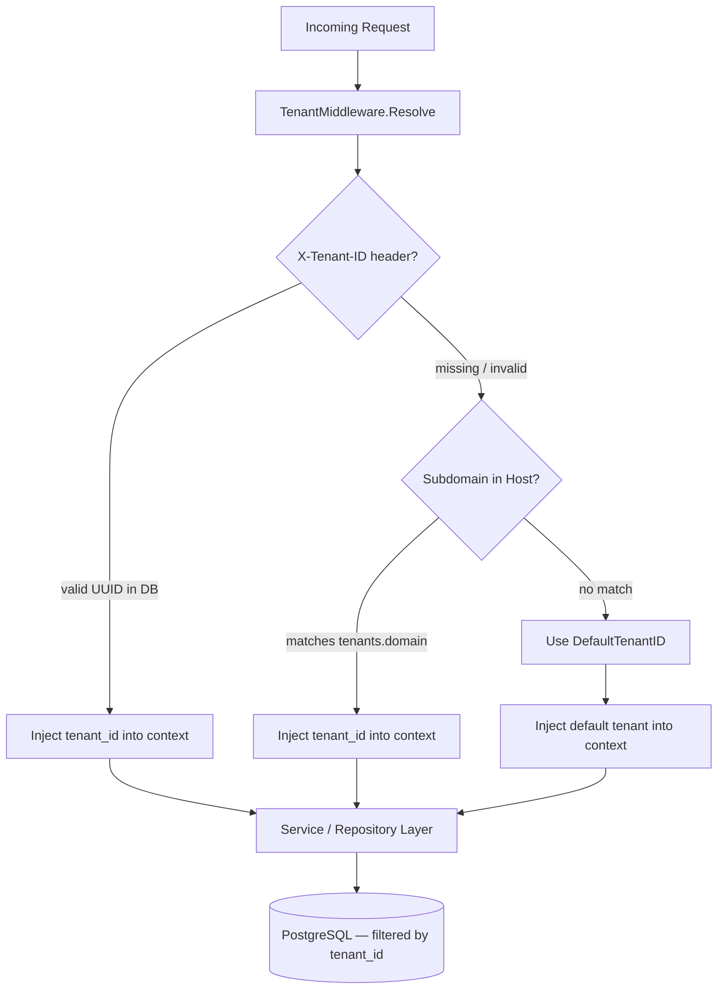
```mermaid
flowchart TD
    R[Incoming Request] --> MW[TenantMiddleware.Resolve]
    MW --> H{X-Tenant-ID header?}
    H -- valid UUID in DB --> CTX1[Inject tenant_id into context]
    H -- missing / invalid --> SD{Subdomain in Host?}
    SD -- matches tenants.domain --> CTX2[Inject tenant_id into context]
    SD -- no match --> DEF[Use DefaultTenantID]
    DEF --> CTX3[Inject default tenant into context]
    CTX1 & CTX2 & CTX3 --> SVC[Service / Repository Layer]
    SVC --> DB[(PostgreSQL — filtered by tenant_id)]
```

### 18.5 Tenant Resolution Order

1. **`X-Tenant-ID` HTTP header** — explicit UUID; looked up in the DB to confirm active.
2. **Subdomain** — first label of `Host` (e.g. `acme.myapp.com` → `acme`); matched against `tenants.domain`.
3. **Default tenant fallback** — single-store deployments require no configuration.

### 18.6 Middleware Usage

```go
// Apply to all routes (silently falls back to default tenant)
r.Use(tenantMW.Resolve)

// Apply to strict multi-tenant routes (returns 401 on invalid tenant header)
r.Use(tenantMW.RequireTenant)

// Retrieve in service / handler
tenantID := middleware.TenantFromContext(ctx)
```

### 18.7 API Endpoints (Admin)

| Method | Path | Permission |
|--------|------|------------|
| `GET` | `/admin/tenants` | `users.manage` |
| `POST` | `/admin/tenants` | `users.manage` |
| `GET` | `/admin/tenants/{id}` | `users.manage` |
| `GET` | `/admin/tenants/{id}/settings` | `users.manage` |
| `PUT` | `/admin/tenants/{id}/settings` | `users.manage` |
| `POST` | `/admin/tenants/{id}/users` | `users.manage` |

### 18.8 Isolation Guarantees

- Each tenant's `orders`, `products`, `inventory`, and `suppliers` are isolated by `tenant_id`.
- `TenantService.ListUsers(tenantID)` only returns users belonging to that tenant.
- `TenantService.GetSettings(tenantID)` is keyed by tenant — settings cannot bleed across tenants.
- Unit tests explicitly verify cross-tenant isolation (`TestTenant_Isolation_*`, `TestTenant_CrossAccess_Denied`).

### 18.9 Key Files

| File | Role |
|------|------|
| `migrations/011_tenants.sql` | Schema + default tenant seed + tenant_id columns |
| `internal/domain/tenant.go` | Tenant, TenantUser, TenantSettings, DefaultTenantID |
| `internal/repository/postgres/tenant.go` | TenantRepository |
| `internal/service/tenant.go` | TenantService |
| `internal/middleware/tenant.go` | TenantMiddleware + TenantFromContext |
| `internal/handler/http/router/tenant_handler.go` | HTTP handlers |
| `internal/service/tenant_test.go` | Unit tests (fake repo) |

---

## 19. Multi-Warehouse / Location Management

### Problem Statement

A single global inventory counter is sufficient for a single-store deployment, but brands with multiple warehouses, retail branches, and drop-ship points need per-location visibility. Staff need to know *which* warehouse holds stock before initiating a transfer, and operations need an audit trail of every unit moved between locations.

### Design Principles

| Principle | Decision |
|-----------|----------|
| Non-breaking | Global `inventory` table is unchanged. `warehouse_stock` is an additive layer. |
| Optional per tenant | Tenants with no warehouses see zero side effects. |
| COGS preserved | Transfers log to `inventory_movements` using `transfer_in` / `transfer_out` types. |
| Concurrency safe | Serializable transaction + `SELECT FOR UPDATE` on both stock rows. |

### Database Schema

```
migrations/012_warehouses.sql
├── ALTER TYPE movement_type ADD VALUE 'transfer_in'
├── ALTER TYPE movement_type ADD VALUE 'transfer_out'
├── CREATE TYPE warehouse_type ENUM (warehouse, store, dropship, virtual)
├── CREATE TABLE warehouses          -- location registry, per-tenant
└── CREATE TABLE warehouse_stock     -- per (warehouse, variant) counters
```

**`warehouses`**

| Column | Type | Notes |
|--------|------|-------|
| `id` | UUID PK | |
| `tenant_id` | UUID FK → tenants | |
| `name` | TEXT | |
| `type` | warehouse_type | warehouse / store / dropship / virtual |
| `address`, `city`, `country` | TEXT | |
| `is_active` | BOOL | |
| `priority` | INT | lower = higher fulfillment priority |

**`warehouse_stock`**

| Column | Type | Notes |
|--------|------|-------|
| `warehouse_id` | UUID FK → warehouses | |
| `variant_id` | UUID FK → variants | |
| `qty_on_hand` | INT ≥ 0 | |
| `qty_reserved` | INT ≥ 0 | |
| `qty_available` | INT GENERATED | `qty_on_hand − qty_reserved` |

### Stock Flow (Transfer)

```mermaid
sequenceDiagram
    participant API
    participant WarehouseService
    participant DB

    API->>WarehouseService: Transfer(from, to, variant, qty)
    WarehouseService->>DB: BEGIN SERIALIZABLE
    WarehouseService->>DB: SELECT warehouse_stock FOR UPDATE (from)
    WarehouseService->>DB: SELECT warehouse_stock FOR UPDATE (to)
    alt from.qty_available < qty
        WarehouseService-->>API: ErrInsufficientStock
    else sufficient stock
        WarehouseService->>DB: UPDATE warehouse_stock SET qty_on_hand -= qty (from)
        WarehouseService->>DB: UPDATE warehouse_stock SET qty_on_hand += qty (to)
        WarehouseService->>DB: INSERT inventory_movements (transfer_out)
        WarehouseService->>DB: INSERT inventory_movements (transfer_in)
        WarehouseService->>DB: COMMIT
        WarehouseService-->>API: TransferResult{from_stock, to_stock, movements}
    end
```

**Transaction safety:** The two `SELECT FOR UPDATE` statements within a `SERIALIZABLE` transaction guarantee that concurrent transfers from the same source warehouse are serialised by PostgreSQL. No two goroutines can both see `qty_available ≥ qty` for the same row simultaneously — one will wait for the other's commit before re-reading.

> Global `inventory.quantity_on_hand` is **not modified** — the transfer is net-neutral for aggregate stock. This preserves all existing FIFO deduction logic.

### Integration with Orders & Inventory

```mermaid
flowchart LR
    subgraph Core
        INV["inventory\n(global aggregate)"]
        FIFO["FIFO deduction\n(SubtractStock)"]
    end
    subgraph Warehouse Layer
        WS["warehouse_stock\n(per-location counters)"]
        XFER["WarehouseService.Transfer"]
    end
    subgraph Audit
        MOV["inventory_movements\n(immutable ledger)"]
    end

    FIFO -->|deduct qty_on_hand| INV
    XFER -->|adjust per-location| WS
    XFER -->|transfer_out + transfer_in| MOV
    FIFO -->|sale_out movements| MOV
```

### Location Prioritization

Warehouses expose a `priority` integer (lower = higher priority). The fulfillment engine selects from the lowest-priority (most preferred) warehouse that has sufficient available stock. This is configurable per tenant.

### API Endpoints

| Method | Path | Permission |
|--------|------|-----------|
| `POST` | `/admin/warehouses` | `inventory.manage` |
| `PUT` | `/admin/warehouses/{id}` | `inventory.manage` |
| `GET` | `/admin/warehouses` | `inventory.manage` |
| `POST` | `/admin/warehouses/{id}/stock` | `inventory.manage` |
| `POST` | `/admin/warehouses/transfer` | `inventory.manage` |
| `GET` | `/admin/warehouses/{id}/inventory` | `inventory.manage` |

### Prometheus Metrics

| Metric | Type | Labels |
|--------|------|--------|
| `dubai_retail_warehouse_transfers_total` | Counter | `from_type`, `to_type` |
| `dubai_retail_warehouse_transfer_qty_total` | Counter | — |
| `dubai_retail_stock_movements_total` | Counter | `movement_type` (transfer_in, transfer_out) |

### Key Files

| File | Purpose |
|------|---------|
| `migrations/012_warehouses.sql` | Schema: warehouses, warehouse_stock, movement_type extension |
| `internal/domain/warehouse.go` | Domain models: Warehouse, WarehouseStock, TransferRequest/Result |
| `internal/repository/postgres/warehouse.go` | DB queries: CRUD, locking, stock adjustment |
| `internal/service/warehouse.go` | Business logic: CreateWarehouse, Transfer, SetStock, GetInventory |
| `internal/handler/http/router/warehouse_handler.go` | HTTP handlers |
| `internal/service/warehouse_test.go` | Unit tests (exhaustion guard, tenant isolation, auto-create dest) |

---

## 20. Customer & Loyalty Module

### Problem Statement

Returning customers are the highest-value segment for a fashion retailer. Without a customer registry and loyalty program, the platform cannot track purchase history, apply tier-based promotions, or reward repeat buyers with redeemable points.

### Design Principles

| Principle | Decision |
|-----------|----------|
| Immutable ledger | `loyalty_transactions` rows are never updated or deleted. |
| Non-breaking | `customer_id` added as nullable FK on `orders`. Guest checkout is unchanged. |
| Tier-driven | Tier advances automatically based on `lifetime_points` thresholds. |
| Points ≠ pricing tier | `LoyaltyTier` (bronze/silver/gold/vip) is separate from the pricing `CustomerTier` (standard/vip/wholesale/staff). |
| Optional per tenant | Tenants that don't register customers see zero side effects. |

### Database Schema

```
migrations/013_customers_loyalty.sql
├── CREATE TYPE loyalty_tier ENUM (bronze, silver, gold, vip)
├── CREATE TYPE loyalty_tx_type ENUM (earned, redeemed, expired, adjusted, refunded)
├── CREATE TABLE customers            -- tenant-scoped customer registry
├── CREATE TABLE loyalty_accounts     -- live points balance per customer (1:1)
├── CREATE TABLE loyalty_transactions -- immutable audit log
└── ALTER TABLE orders ADD COLUMN customer_id (nullable FK)
```

**Tier Thresholds (lifetime points)**

| Tier | Minimum Points |
|------|---------------|
| Bronze | 0 |
| Silver | 1,000 |
| Gold | 5,000 |
| VIP | 20,000 |

**Points Economy**

| Rate | Value |
|------|-------|
| Earn rate | 1 point per AED spent (floor) |
| Redeem rate | 100 points = 1 AED discount |

### Loyalty Points Flow

```mermaid
flowchart TD
    ORDER_COMPLETE["Order Completed"] --> AWARD["LoyaltyService.AwardPoints\npoints = floor(total_aed) × earn_rate"]
    AWARD --> LOCK["BEGIN REPEATABLE READ\nSELECT loyalty_account FOR UPDATE"]
    LOCK --> UPDATE_BAL["UPDATE loyalty_accounts\npoints_balance += points\nlifetime_points += points"]
    UPDATE_BAL --> INSERT_TX["INSERT loyalty_transactions\ntx_type = earned"]
    INSERT_TX --> COMMIT["COMMIT"]
    COMMIT --> TIER_CHECK["maybePromoteTier\nlifetime_points threshold check"]
    TIER_CHECK --> UPDATE_TIER["UPDATE customers.loyalty_tier"]

    CHECKOUT["Checkout with Redemption"] --> REDEEM["LoyaltyService.RedeemPoints\npoints_to_redeem"]
    REDEEM --> CHECK_BAL{"balance ≥ points_to_redeem?"}
    CHECK_BAL -- No --> ERR["ErrInsufficientPoints"]
    CHECK_BAL -- Yes --> DEDUCT["UPDATE loyalty_accounts\npoints_balance -= points"]
    DEDUCT --> INSERT_TX2["INSERT loyalty_transactions\ntx_type = redeemed"]
    INSERT_TX2 --> DISCOUNT["Return DiscountAED\n= points / redeem_rate"]
```

### Class Diagram

```mermaid
classDiagram
    class Customer {
        +UUID id
        +UUID tenant_id
        +string email
        +string full_name
        +LoyaltyTier loyalty_tier
        +bool is_active
    }
    class LoyaltyAccount {
        +UUID id
        +UUID customer_id
        +int points_balance
        +int lifetime_points
    }
    class LoyaltyTransaction {
        +UUID id
        +UUID account_id
        +UUID order_id
        +LoyaltyTxType tx_type
        +int points
        +int balance_before
        +int balance_after
    }
    Customer "1" --> "1" LoyaltyAccount : has
    LoyaltyAccount "1" --> "*" LoyaltyTransaction : logs
```

### Integration with Orders & Pricing

When `CustomerID` is present in `ProcessOrderInput`, it is stamped on the order row and the caller (POS handler / webhook) can subsequently call `LoyaltyService.AwardPoints` to credit the customer.

```mermaid
sequenceDiagram
    participant POS as POS / ecommerce handler
    participant OrderSvc as OrderService
    participant LoyaltySvc as LoyaltyService
    participant DB

    POS->>OrderSvc: ProcessOrder({customer_id, lines, ...})
    OrderSvc->>DB: INSERT orders (customer_id stamped)
    OrderSvc-->>POS: ProcessOrderResult{order, fifo, invoice}

    Note over POS,LoyaltySvc: Points awarded post-commit (non-blocking)
    POS->>LoyaltySvc: AwardPoints({customer_id, order_id, total_aed})
    LoyaltySvc->>DB: BEGIN REPEATABLE READ
    LoyaltySvc->>DB: SELECT loyalty_accounts FOR UPDATE
    LoyaltySvc->>DB: UPDATE points_balance += floor(total_aed)
    LoyaltySvc->>DB: INSERT loyalty_transactions (earned)
    LoyaltySvc->>DB: COMMIT
    LoyaltySvc-->>LoyaltySvc: maybePromoteTier(customer_id)
    LoyaltySvc->>DB: UPDATE customers SET loyalty_tier = ...
```

### Checkout with Redemption

```mermaid
sequenceDiagram
    participant Checkout
    participant LoyaltySvc as LoyaltyService
    participant OrderSvc as OrderService

    Checkout->>LoyaltySvc: RedeemPoints({customer_id, points_to_redeem})
    LoyaltySvc-->>Checkout: DiscountAED = points / 100
    Checkout->>OrderSvc: ProcessOrder({lines, discount_amount: DiscountAED})
    OrderSvc-->>Checkout: ProcessOrderResult with discount applied
```

### API Endpoints

| Method | Path | Description |
|--------|------|-------------|
| `POST` | `/customers` | Register a new customer |
| `GET` | `/customers/{id}` | Get customer profile + loyalty balance |
| `POST` | `/customers/{id}/points/add` | Award points (staff / order webhook) |
| `POST` | `/customers/{id}/points/redeem` | Redeem points for AED discount |
| `GET` | `/customers/{id}/points/history` | Transaction history |

### Prometheus Metrics

| Metric | Type | Description |
|--------|------|-------------|
| `dubai_retail_loyalty_points_earned_total` | Counter | Points awarded to customers |
| `dubai_retail_loyalty_points_redeemed_total` | Counter | Points spent by customers |
| `dubai_retail_loyalty_tier_changes_total` | Counter (`from_tier`, `to_tier`) | Tier promotions |

### Key Files

| File | Purpose |
|------|---------|
| `migrations/013_customers_loyalty.sql` | Schema: customers, loyalty_accounts, loyalty_transactions; adds customer_id to orders |
| `internal/domain/customer.go` | Domain models: Customer, LoyaltyAccount, LoyaltyTransaction, PointsRedemptionResult |
| `internal/domain/order.go` | `Order.CustomerID *uuid.UUID` (nullable FK) |
| `internal/service/order.go` | `ProcessOrderInput.CustomerID` stamps customer on order row |
| `internal/repository/postgres/customer.go` | DB queries: customer CRUD, account management, points ledger |
| `internal/service/customer.go` | Business logic: CustomerService, LoyaltyService, tier engine |
| `internal/handler/http/router/customer_handler.go` | HTTP handlers |
| `internal/service/customer_test.go` | Unit tests (earn/redeem/tier/tenant-isolation) |
| `internal/service/integration_test.go` | Integration tests: CustomerID stamped on order, loyalty data for award |

---

## Updated Environment Variables

| Variable | Default | Description |
|----------|---------|-------------|
| `JWT_SECRET` | `change_me_to_a_32_byte_secret!!!` | HMAC-SHA256 signing key for JWTs |
| `JWT_ACCESS_TTL_MIN` | `15` | Access token TTL in minutes |
| `JWT_REFRESH_TTL_DAYS` | `7` | Refresh token TTL in days |
| `ASP_SANDBOX_ENDPOINT` | — | ASP sandbox validation URL |
| `ASP_API_KEY` | — | ASP API key |
| `SLACK_WEBHOOK_OPS` | — | Operations team Slack webhook |
| `SLACK_WEBHOOK_CRITICAL` | — | Critical alerts Slack webhook |
| `SLACK_WEBHOOK_COMPLIANCE` | — | Compliance team Slack webhook |
| `SLACK_WEBHOOK_ENGINEERING` | — | Engineering team Slack webhook |
